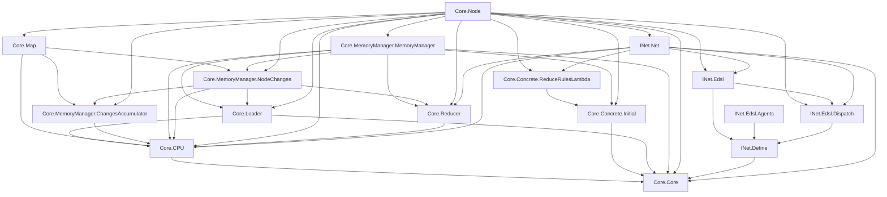

<!-- GENERATED by agent-scripts/gen-module-graph.sh — do not edit by hand -->

```mermaid
flowchart TD
    Core.Concrete.ReduceRulesLambda --> Core.Concrete.Initial
    Core.MemoryManager.MemoryManager --> Core.Concrete.Initial
    Core.Node --> Core.Concrete.Initial
    Core.Node --> Core.Concrete.ReduceRulesLambda
    INet.Net --> Core.Concrete.ReduceRulesLambda
    Core.CPU --> Core.Core
    Core.Concrete.Initial --> Core.Core
    Core.Loader --> Core.Core
    Core.MemoryManager.MemoryManager --> Core.Core
    Core.Node --> Core.Core
    INet.Define --> Core.Core
    INet.Net --> Core.Core
    Core.Loader --> Core.CPU
    Core.Map --> Core.CPU
    Core.MemoryManager.ChangesAccumulator --> Core.CPU
    Core.MemoryManager.MemoryManager --> Core.CPU
    Core.MemoryManager.NodeChanges --> Core.CPU
    Core.Node --> Core.CPU
    Core.Reducer --> Core.CPU
    INet.Net --> Core.CPU
    Core.MemoryManager.MemoryManager --> Core.Loader
    Core.MemoryManager.NodeChanges --> Core.Loader
    Core.Node --> Core.Loader
    Core.Node --> Core.Map
    Core.Map --> Core.MemoryManager.ChangesAccumulator
    Core.MemoryManager.NodeChanges --> Core.MemoryManager.ChangesAccumulator
    Core.Node --> Core.MemoryManager.ChangesAccumulator
    Core.Node --> Core.MemoryManager.MemoryManager
    Core.Map --> Core.MemoryManager.NodeChanges
    Core.MemoryManager.MemoryManager --> Core.MemoryManager.NodeChanges
    Core.Node --> Core.MemoryManager.NodeChanges
    Core.MemoryManager.MemoryManager --> Core.Reducer
    Core.MemoryManager.NodeChanges --> Core.Reducer
    Core.Node --> Core.Reducer
    INet.Net --> Core.Reducer
    INet.Edsl --> INet.Define
    INet.Edsl.Agents --> INet.Define
    INet.Edsl.Dispatch --> INet.Define
    Core.Node --> INet.Edsl.Dispatch
    INet.Edsl --> INet.Edsl.Dispatch
    INet.Net --> INet.Edsl.Dispatch
    Core.Node --> INet.Edsl
    INet.Net --> INet.Edsl
    Core.Node --> INet.Net
```
